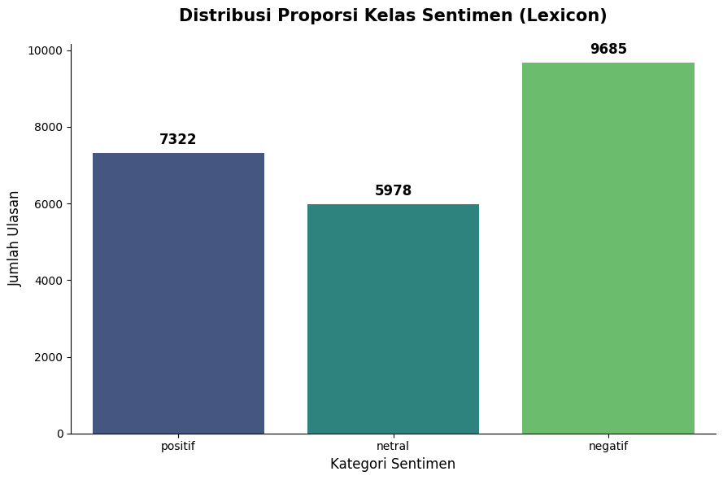
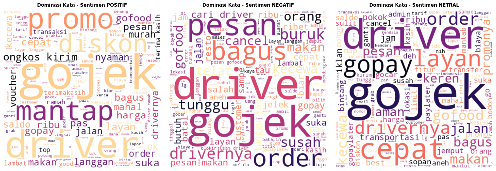
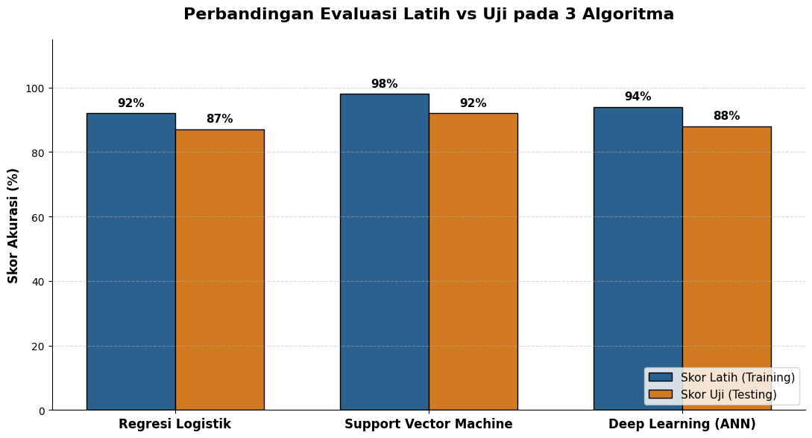

# Gojek Sentiment Analysis using Machine Learning and Deep Learning

## Overview
This project focuses on sentiment analysis of Gojek app reviews using Machine Learning and Deep Learning approaches. The main objective is to classify user reviews into sentiment categories and compare model performance in understanding Indonesian-language text data.

The project covers the complete AI workflow starting from data collection through web scraping, preprocessing Indonesian text, sentiment labeling, model training, evaluation, and prediction simulation.

---

## Features
- Web scraping of Gojek app reviews
- Indonesian text preprocessing and cleaning
- Slang word normalization
- Stopword removal and stemming
- Sentiment labeling
- Machine Learning and Deep Learning model comparison
- Sentiment prediction simulation

---

## Models Used

### Machine Learning
- Logistic Regression
- Support Vector Machine (SVM)

### Deep Learning
- Artificial Neural Network (ANN)

---

## Technologies & Libraries
- Python
- Google Colab
- Pandas
- NumPy
- Scikit-learn
- TensorFlow / Keras
- Sastrawi
- Matplotlib
- Seaborn

---

## Project Structure

```bash
gojek-sentiment-analysis-ml-dl/
│
├── dataset/
│   ├── dataset_gojek_siap_latih.csv
│   └── README.md
│
├── images/
│   ├── model_comparison.png
│   ├── sentiment_distribution.png
│   ├── wordcloud.png
│   └── README.md
│
├── notebook/
│   ├── gojek_review_scraping.ipynb
│   ├── gojek_sentiment_analysis.ipynb
│   └── README.md
│
├── README.md
├── LICENSE
└── .gitignore
```

---

## Dataset
The dataset consists of Indonesian-language Gojek app reviews collected through web scraping. The data was cleaned and processed before being used for sentiment analysis experiments.

---

## Results

### Sentiment Distribution


---

### Word Cloud Visualization


---

### Model Performance Comparison


The project compares Machine Learning and Deep Learning models for Indonesian sentiment analysis tasks and evaluates their performance using classification metrics.

---

## Future Improvements
- Deploy the model into a web application
- Implement advanced NLP architectures such as LSTM or Transformers
- Improve sentiment labeling techniques
- Expand dataset coverage for better generalization

---

## Author
**Mohammad Raihan Hadriansyah Prasetya**

Telecommunication Engineering Student  
AI & Machine Learning Enthusiast

